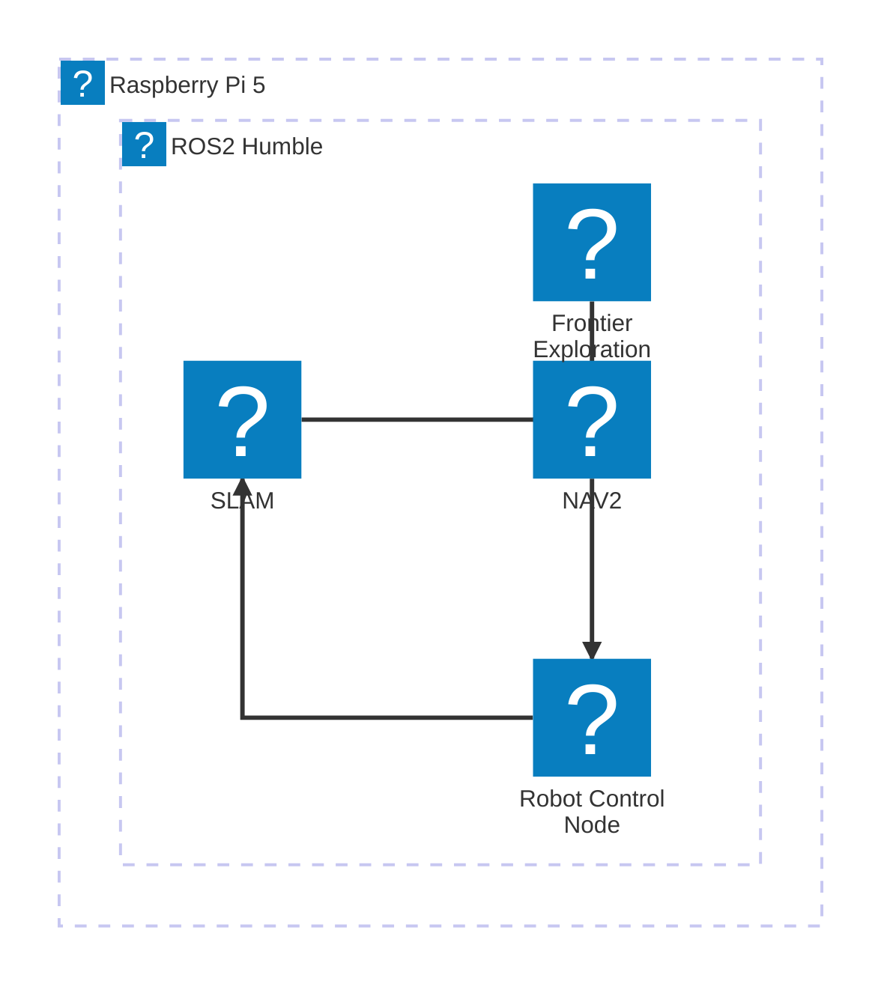

```mermaid
architecture-beta

    group pi(logos:raspberry-pi)[Raspberry Pi 5]
    group ros(logos:ros)[ROS2 Humble] in pi
        service slam(mdi:map-marker-path)[SLAM] in ros
        service nav2(mdi:navigation-variant)[NAV2] in ros
        service explore(mdi:magnify-expand)[Frontier Exploration] in ros
        service control(mdi:chip)[Robot Control Node] in ros

        junction junctionPi

        slam:R -- L:junctionPi
        explore:B -- T:junctionPi
        nav2:L -- R:junctionPi
        control:T <-- B:nav2
        control:L --> B:slam


```